# Coriander Player

一款使用 Material You 配色的本地音乐播放器。**v1.5.2**

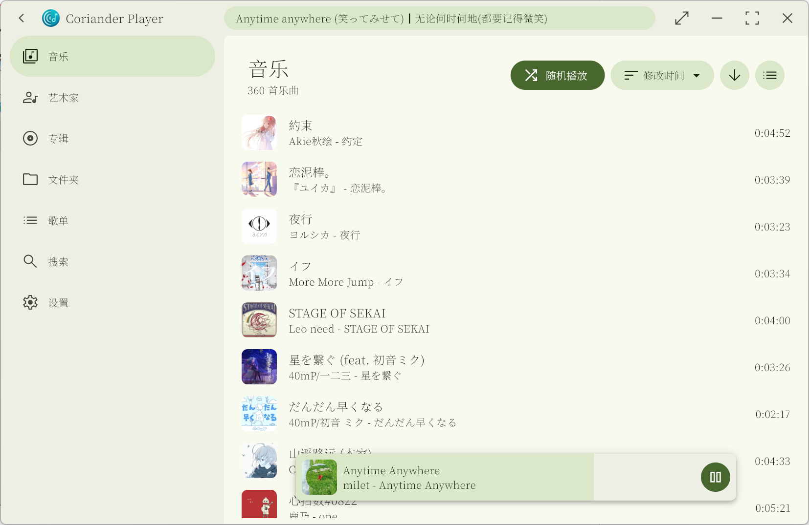

## [更多软件截图在下面（点我滚动到下面）](#软件截图)

**该播放器发行版已经附带桌面歌词组件。项目仓库请见 [desktop_lyric](https://github.com/Ferry-200/desktop_lyric.git)**

---

## 与本体的差异

本项目 fork 自 [Ferry-200/coriander_player](https://github.com/Ferry-200/coriander_player)，在保留原版全部功能的基础上新增了以下特性：

### ✨ 新增功能

| 功能 | 说明 |
|------|------|
| **播放统计** | 记录每首歌的播放次数、收听时长，支持按今天/本周/本月/上月/全部/自定义时间范围筛选 |
| **统计图表** | 直方图展示收听时段分布（按小时/按天/按月），Y 轴和柱上标签显示格式化时长（如 1h30m、45min） |
| **播放列表持久化** | 关闭应用后自动保存当前播放列表和播放进度，下次启动恢复 |
| **在线歌词保存到本地** | 在歌词菜单中将匹配到的在线歌词保存为 `.lrc` 文件到歌曲同目录 |
| **歌词写入音频标签** | 将歌词直接写入音频文件的元数据标签（需 Lofty 支持的格式：mp3、flac、m4a、ogg、opus 等） |
| **持续收听时长追踪** | 精确追踪每首歌的有效收听时间（基于增量进度累加，抗回拖作弊），计入统计数据 |
| **逐字歌词支持** | 解析并显示 Qrc（QQ 音乐）、Krc（酷狗音乐）、Elrc（增强型逐字歌词）三种格式 |
| **桌面歌词逐字同步** | 在 desktop_lyric 桌面歌词窗口中展示逐字歌词效果 |
| **GitHub Actions CI** | 手动触发自动构建 Windows 安装包，集成 BASS 音频库和桌面歌词组件 |

### 🛠️ 技术改进

- 升级 Flutter 至 3.44.0，Material You 动态配色适配
- Rust 后端新增 `tag_writer` 模块（基于 Lofty 0.21），支持将歌词写入音频文件标签
- Rust 后端新增 `installed_font`、`system_theme` 等模块，增强平台集成能力
- 应用数据目录从 `com.example/coriander_player` 迁移到 `Documents/coriander_player`
- 修复了原版若干问题（播放列表状态丢失、BASS 插件加载路径等）

---

## 安装

1. 下载 [Release](https://github.com/Ferry-200/coriander_player/releases/latest) 里文件安装
2. **（已过时）** 你也可以到 [Action 构建版本（体验版）介绍](https://github.com/Ferry-200/coriander_player/issues/49) 下载体验版
3. 通过 scoop 安装，使用此 [bucket](https://github.com/jinzhongjia/scoop-bucket)

```sh
scoop bucket add jin https://github.com/jinzhongjia/scoop-bucket
scoop install jin/coriander_player
```

## 其他平台支持

- MacOS: [https://github.com/marscey/coriander_player/tree/macos-platform](https://github.com/marscey/coriander_player/tree/macos-platform)
- Linux: [https://github.com/Sh12uku/coriander_player_linux]()

## 软件内快捷键

- Esc：返回上一级
- 空格：暂停/播放
- Ctrl + 左方向键：上一曲
- Ctrl + 右方向键：下一曲

## 支持播放的音乐格式

- mp3, mp2, mp1
- ogg
- wav, wave
- aif, aiff, aifc
- asf, wma
- aac, adts
- m4a
- ac3
- amr, 3ga
- flac
- mpc
- mid
- wv, wvc
- opus
- dsf, dff
- ape

## 支持下列音乐格式的内嵌歌词

- aac
- aiff
- flac
- m4a
- mp3
- ogg
- opus
- wav（标签必须用 UTF-8 编码）

其他格式的只支持同目录的 lrc 文件或者是网络歌词

## 外挂 LRC 支持编码

- utf-8
- utf-16

## 选择默认歌词

默认情况下，软件会先读取本地歌词。如果没有，则匹配在线歌词。
你可以在正在播放界面的歌词切换按钮展开的菜单中进入选择默认歌词的页面。

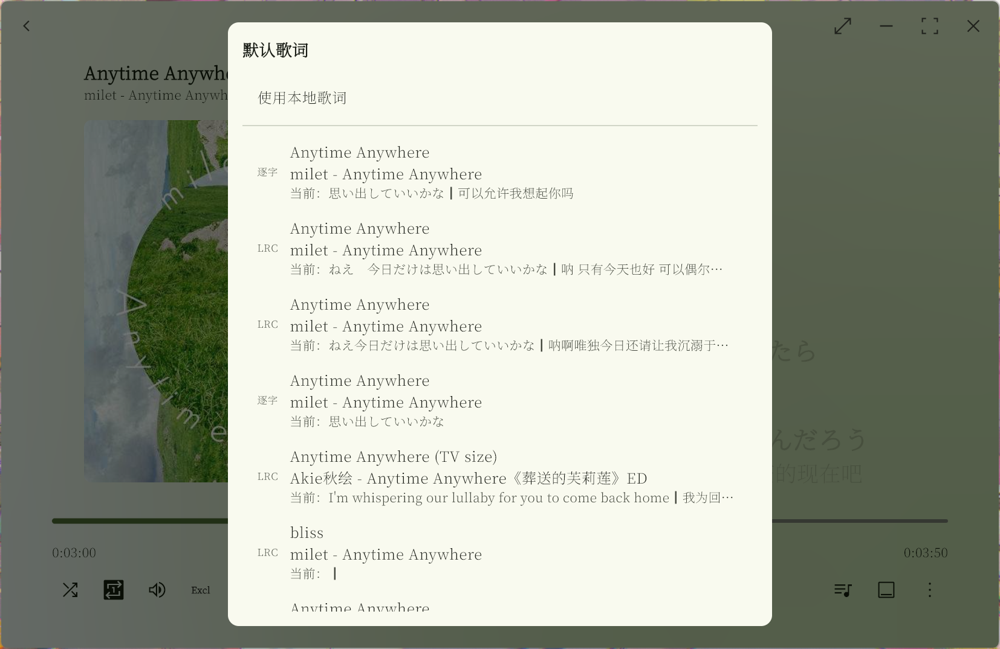

## 提供建议、提交 Bug 或者提 PR

1. 如果要提交 Bug，请创建一个新的 issue。尽可能说明复现步骤并提供截图。
2. 如果你提交 PR，可以自由操作分支。

## 编译

1. 安装 Flutter 开发环境
2. 编译 Coriander Player 本体和 [desktop_lyric](https://github.com/Ferry-200/desktop_lyric.git)（也是 Flutter 应用，直接编译即可）
3. 将 desktop_lyric 产物放在软件目录的 `desktop_lyric/` 目录中
4. 将 BASS 库的 64 位文件（`bass.dll`, `bassape.dll`, `bassdsd.dll`, `bassflac.dll`, `bassmidi.dll`, `bassopus.dll`, `basswv.dll`, `basswasapi.dll`）放在软件目录的 `BASS` 文件夹下

## 歌词特性解释

1. **LRC 歌词的间奏识别**

   在一些 LRC 歌词中，会使用只有时间标签而内容为空的一行来表示上一行的结束。例如：

   ```
   [02:32.57]那天没能放声大哭的我
   [02:39.94]
   [02:55.18]光芒普照整个世界 珍贵之人绽放于心
   ```

   如果这一行（第二行）的时间戳和下一行的时间戳之间大于 5s，就把这两行之间的时间作为间奏时长。所以，不是所有 LRC 歌词在间奏时都能显示间奏动画。

2. **逐字歌词的间奏识别**

   逐字歌词都会给出每一行的开始时间和持续时间，所以识别间奏会简单得多。例如第一行的开始时间是 5905ms，持续 5466ms（5905 + 5466 = 11371），第二行开始时间是 23037ms，相差超过 5000ms，所以这两行之间可以插入表示间奏的空白行。

## 感谢

- [music_api](https://github.com/yhsj0919/music_api.git)：实现歌曲的匹配和歌词的获取
- [Lofty](https://crates.io/crates/lofty)：歌曲标签获取
- [BASS](https://www.un4seen.com/bass.html)：播放乐曲
- [flutter_rust_bridge](https://pub.dev/packages/flutter_rust_bridge)：实现 Windows 原生交互
- [Silicon7921](https://github.com/Silicon7921)：绘制了新图标
- [Ferry-200](https://github.com/Ferry-200)：原版 Coriander Player 作者

## 软件截图


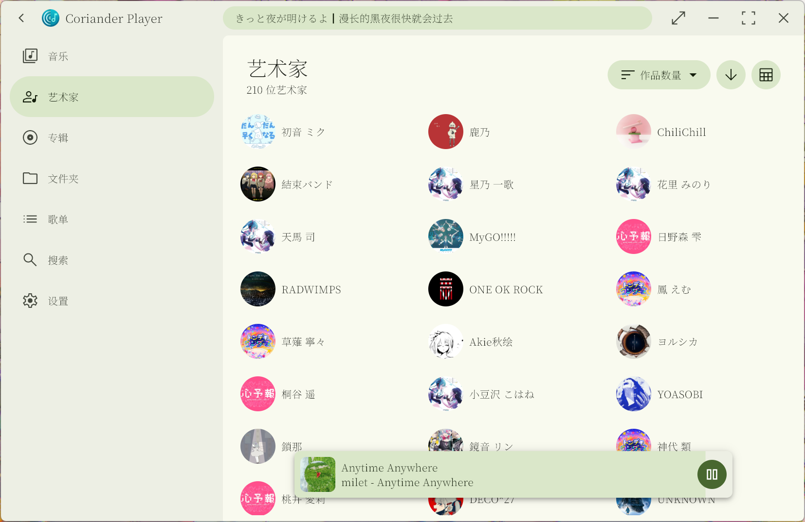
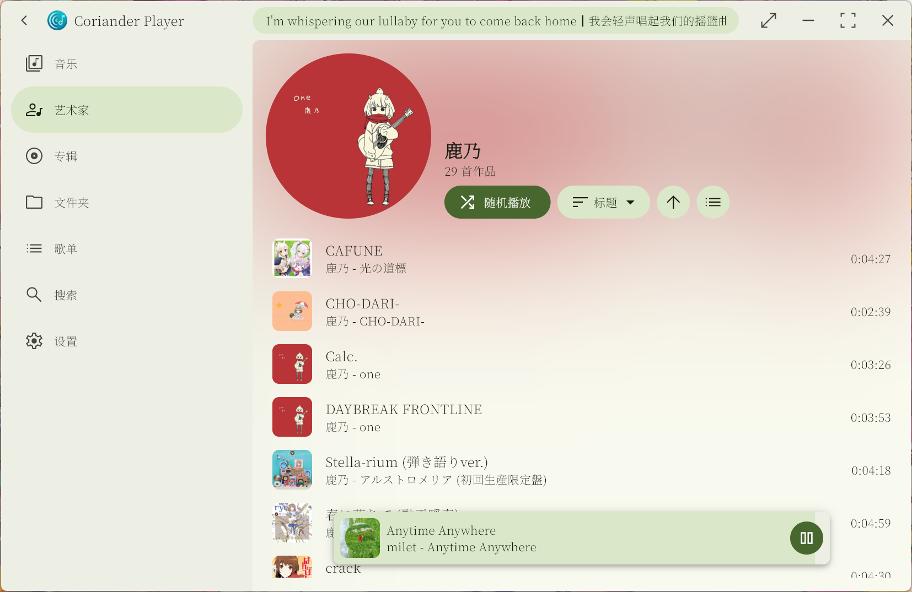
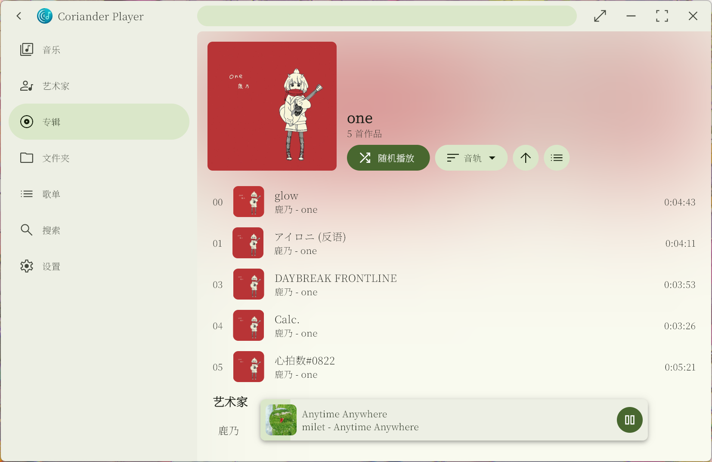
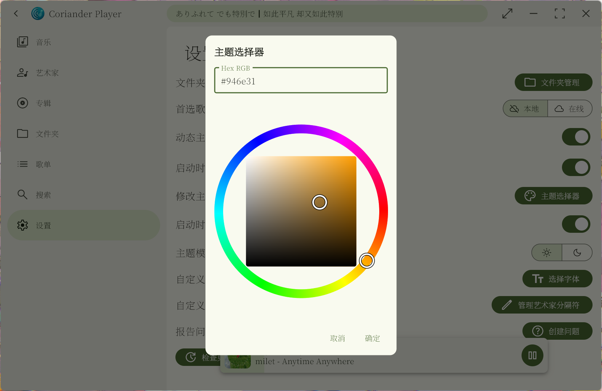
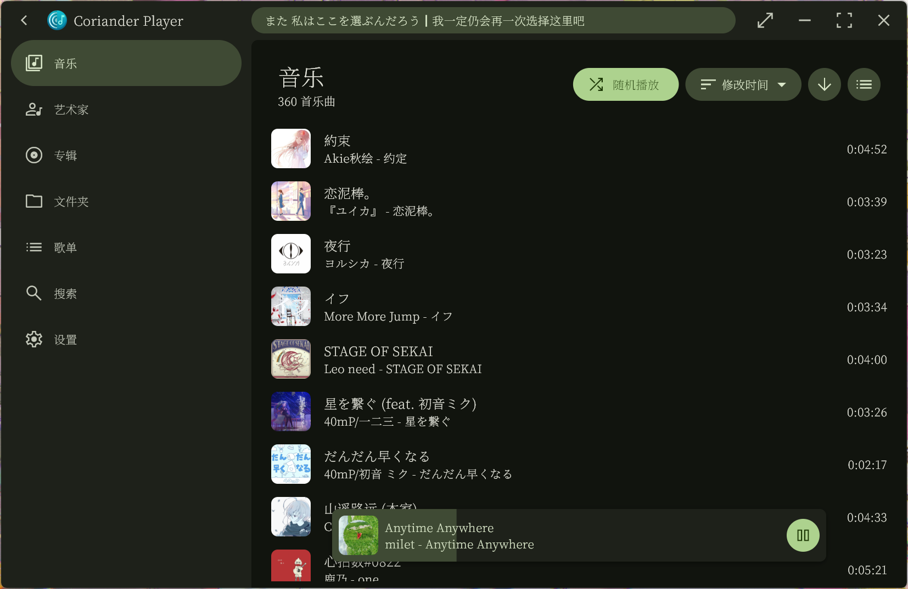
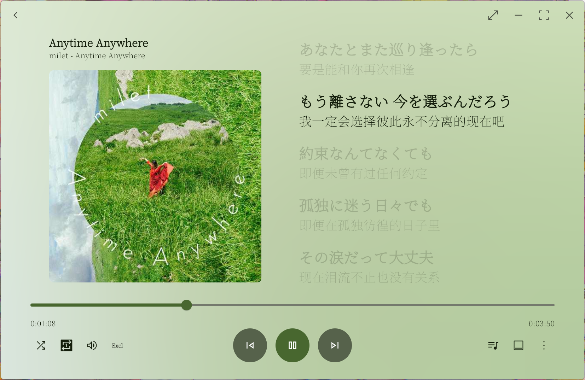
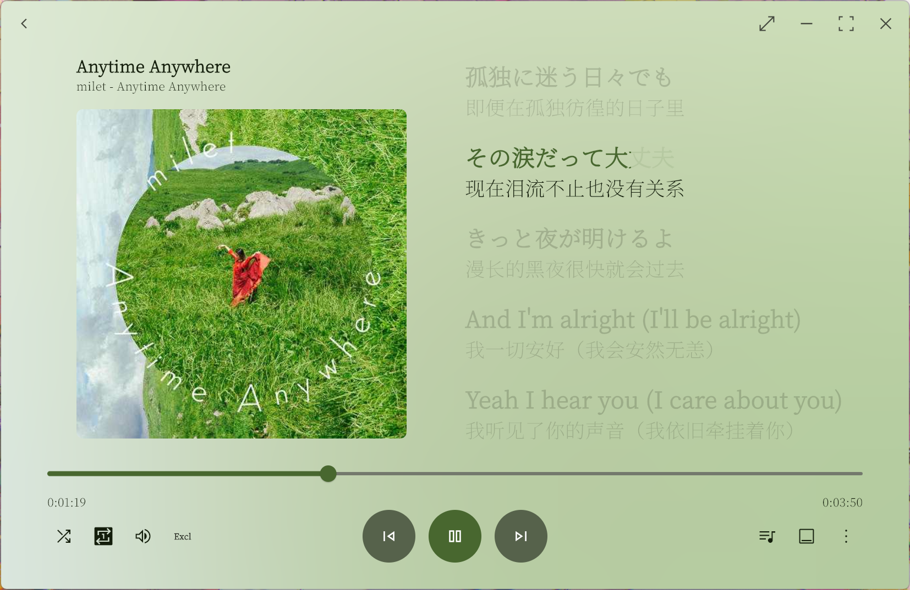
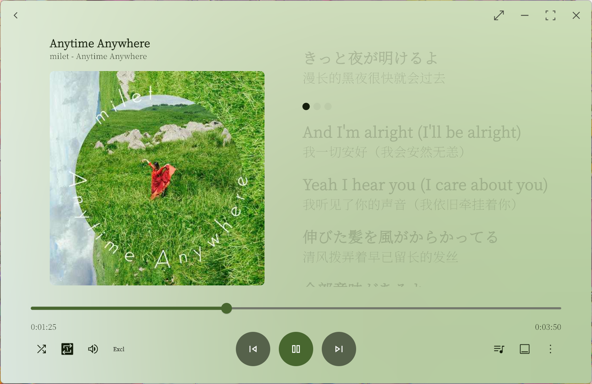
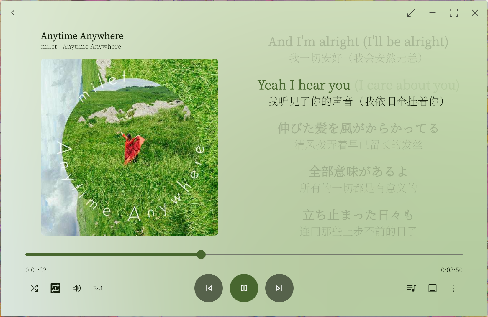
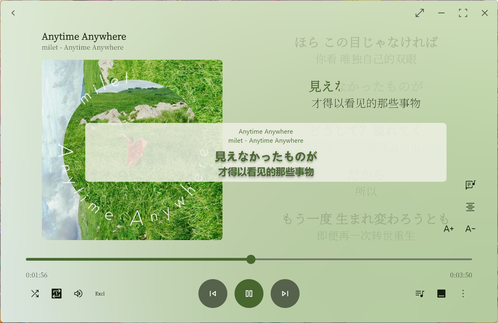


