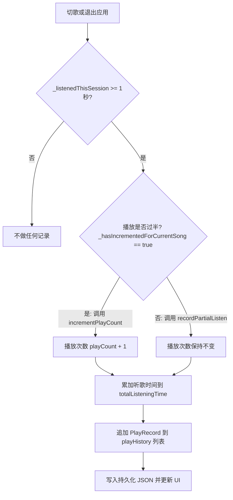

# Coriander Player 播放时长与统计机制设计文档

本项目实现了一套高精度、抗作弊且能够全额累加的播放数据统计系统。统计数据持久化存储于 `statistics.json` 文件中。

---

## 1. 核心数据结构

播放统计主要由以下三个模型（位于 [statistics_service.dart](file:///d:/work/coriander_player/lib/play_service/statistics_service.dart)）支撑：

*   **`PlayRecord` (单次播放记录)**：
    *   `path`: 音频文件绝对路径。
    *   `playedAt`: 本次收听发生的时间戳。
    *   `listenedSeconds`: 本次会话实际收听时长（秒）。
*   **`AudioStatistics` (歌曲统计汇总)**：
    *   `playCount`: 累计播放次数。
    *   `lastPlayed`: 上次播放时间戳（秒）。
    *   `totalListeningTime`: 累计听歌时长（秒）。
    *   `playHistory`: 该歌曲最近最多 200 条 `PlayRecord` 记录。
*   **`StatisticsService` (统计管理服务)**：
    *   维护全局歌曲路径到 `AudioStatistics` 的映射。
    *   提供按播放次数、收听时间、最后播放时间的排序查询，以及按日期范围的检索功能。

---

## 2. 运行时时长跟踪算法

在播放歌曲时，播放状态追踪由 [playback_service.dart](file:///d:/work/coriander_player/lib/play_service/playback_service.dart) 实时处理：

### 2.1 增量时间累加 (Incremental Tracking)
为了避免用户**往回拖动进度条**（Seeking Backward）或**行内重复播放**导致收听时长被成倍放大，系统采用“最大进度增量累加”算法：
1.  开始播放新歌曲时，重置：
    *   `_maxTrackedPosition = 0.0` (当前会话中播放进度条到达的最大位置，秒)
    *   `_listenedThisSession = 0.0` (当前会话中累计实际收听时长，秒)
2.  在播放器的进度流监听器（每 33ms 触发）中：
    *   当当前进度 `progress` 超过了以往的最大跟踪位置时：
        $$\Delta t = \text{progress} - \text{_maxTrackedPosition}$$
        将增量 $\Delta t$ 累加到 `_listenedThisSession` 中。
    *   将 `_maxTrackedPosition` 更新为当前进度值 `progress`。
    *   *注：若用户往回拖拽进度条，由于 `progress` $\le$ `_maxTrackedPosition`，增量计算不成立，从而完美规避了重复计时的 Bug。*

### 2.2 播放次数的过半判定 (Halfway Mark)
为防止用户通过反复拉进度条在单次收听中刷播放量，系统执行过半判定：
*   当进度流检测到 $\text{progress} \ge \frac{\text{length}}{2}$ 时，将过半标记置为 `_hasIncrementedForCurrentSong = true` / `_hasIncrementedForCurrentSong = true`。

---

## 3. 会话结算与数据归档 (Session Finalization)

当以下两个事件触发时，系统会对当前歌曲的收听会话进行收尾结算（调用 `_finalizePlaySession`）：
1.  **切换歌曲**：切歌、播放下一曲或点击播放列表中的新歌。
2.  **退出应用**：播放器服务注销并退出。

### 3.1 结算分支处理
如果 `_listenedThisSession` 至少累积了 1 秒，将进行分流归档：

*   **过半结算 (完整播放)**：
    *   调用 `incrementPlayCount(path, listenedSeconds: secs)`。
    *   `playCount` 递增 1。
    *   累加实际收听时间，生成 `PlayRecord` 历史。
*   **未过半结算 (部分收听)**：
    *   调用 `recordPartialListen(path, listenedSeconds: secs)`。
    *   **不增加**播放次数，仅累加实际收听时长，并生成 `PlayRecord` 历史。

这套设计在兼顾统计准确性（不漏掉碎片的收听时长）的同时，保证了播放量指标的真实有效性。
